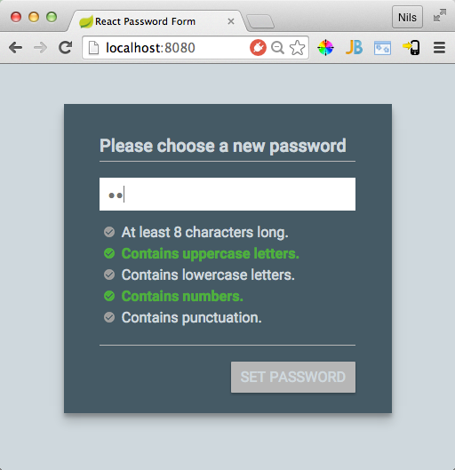

React password field example
============================

A simple react example implementing a password field component, inspired by this blog post: https://aerotwist.com/blog/better-password-form-fields/

Run
---
* clone the git repository
* `npm install`
* `npm run devserver`
* In your webbrowser open http://localhost:8080
* Choose a password ;-)

Running example
---------------
* You can find a running example here: https://nilshartmann.github.io/react-example-app/

See also
--------

* If you're using ClosureScript/Reagent: find a ported version of the password field example here: https://github.com/rpreissel/reagent-example-app/

